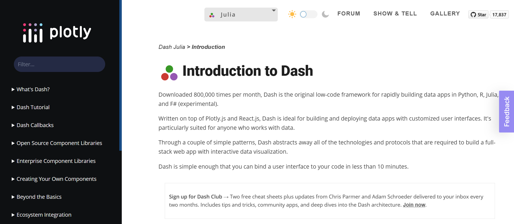
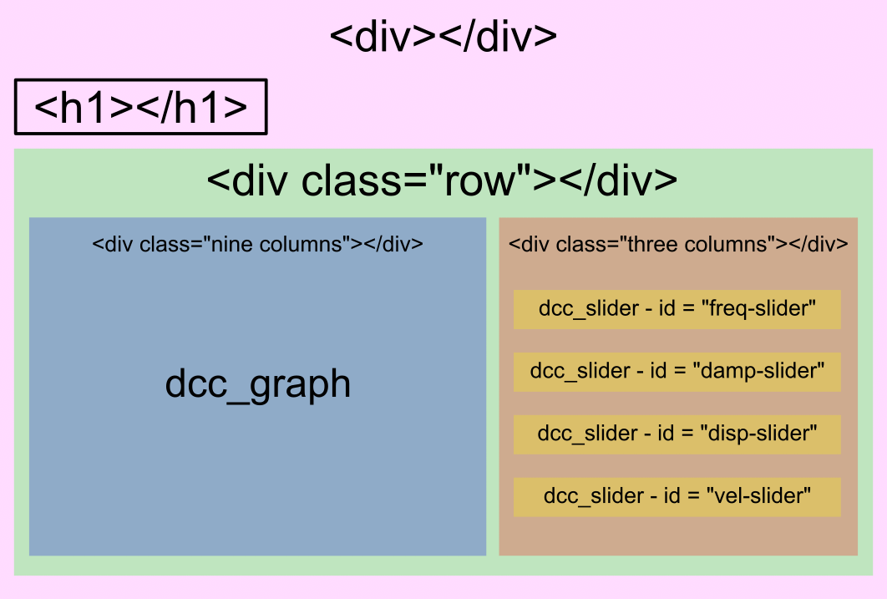

---
This post has been first publish on Julia Forem. To read the original post, please visit [Julia Forem](https://forem.julialang.org/maucejo/make-beautiful-web-apps-with-dashjl-4kkf).

---

Until recently, I mainly used Matlab and Python for my research and teaching activities. In the last context, I developed some apps to illustrate some concepts of mechanical vibrations such as the free vibration motion of undamped/damped spring-mass oscillators. To this end, my worflow was as follows:
1. Develop the apps using Ploty Dash in Python
2. Embed the apps in a reveal.js presentation using HTML `iframe`

But all of this was before I decided to move from Matlab/Python to Julia. As every Julian newcomer, I had to revise my workflow, find the right packages, think the Julian way, and so on. Everything is not perfect, but I like coding in Julia and the community is really supportive with newbies. That is why, I decided to translate my Dash.py apps into Dash.jl apps.

## Table Of Contents
1. [First steps](#FirstSteps)
2. [A little maths](#maths)
3. [Let's code this in Julia using Dash.jl](#code)
4. [Final thoughts](#conclusion)
5. [Version info](#version)

## 1. First steps <a name="FirstSteps"></a>

When I want to discover a framework, I directly go to the documentation page or the dedicated website. Here, we have to visit the [Plotly Dash website](https://dash.plotly.com/julia/introduction).

<figure>

<figcaption>Plotly Dash welcome page</figcaption>
</figure>

Good news! There is a Julia section. Here is a brief and non exhaustive list of what is dedicated to Julia:
1. How to install Dash.jl ?
2. Basic Dash layout. This section is ideal to start with Dash and develop static apps.
3. Basic callbacks or how to transform your Dash layout into an interactive app.
4. A section dedicated to advanced callbacks.

And that's all for the moment (Dec. 2022), since the other parts of the doc are either populated with Python examples or simply not written. For instance, in the interactive visualizations section, it is indicated:

> This example has not been ported to Julia yet - showing the Python version instead.
>
> Visit the old docs site for Julia at: https://community.plotly.com/c/dash/julia/20

In the other sections, it is mentioned:

> This page is not yet available in Julia — check back soon! In the meantime, you can refer to the Python documentation on this topic or post your question in the **Dash Julia forum!**

Humm! It is not very engaging... But, Plotly people are right! Indeed, even if everything is not documented, the available documentation combined with the Python one is sufficient to to develop our superb web apps in Julia!

## 2. A little maths <a name="maths"></a>

The equation of motion of a damped spring-mass system is given by:

$$
 \ddot x(t) + 2\xi\omega_0\dot x(t) + \omega_0^2 = 0,
$$

where 
 $x(t)$
 is the displacement of the mass, 
 $\xi$
 is the damping ratio and 
 $\omega_0$
 is the natural angular frequency.

Depending on the value of the daming ratio, we can observe four distinct behavior for a given set of initial displacement 
 $x_0$
 and velocity 
 $v_0$
.

* If 
 $\xi = 0$
, the motion of the mass is undamped and:

$$
 x(t) = x_0\cos\omega_0 t + \frac{v_0}{\omega_0}\sin\omega_0 t,
$$

* if 
 $\xi \in ]0, 1[$
, the motion of the mass is under-damped and:

$$
 x(t) = \left[x_0\cos\Omega_0 t + \frac{v_0 + \xi\omega_0 x_0}{\Omega_0}\sin\Omega_0 t\right]e^{-\xi\omega_0 t},
$$

where 
 $\Omega_0 = \omega_0\sqrt{1 - \xi^2}$
 is the pseudo natural angular frequency.
* if 
 $\xi > 1$
, the motion of the mass is over-damped and:

$$ x(t) = \left[x_0\cos\beta t + \frac{v_0 + \xi\omega_0 x_0}{\Omega_0}\sin\beta t\right]e^{-\xi\omega_0 t}$$

where 
 $\beta = \omega_0\sqrt{\xi^2 - 1}.$

* if where 
 $\xi = 1$
, the motion of the mass is critically damped and:
where 
$$ x(t) = (x_0 + \omega_0 x_0 t + v_0 t)e^{-\omega_0 t}$$
.

The goal of the app is to plot the displacement of the mass for a given set where 
$(f_0, \xi, x_0, v_0)$
, where 
$f_0 = \frac{\omega_0}{2\pi}$
 is the resonance frequency of the mass-spring system. More precisely, we want to obtain something that looks like the following picture.

<figure>

<figcaption>Picture of the app we want to obtain!</figcaption>
</figure>

## 3. Let's code this in Julia using Dash.jl <a name="code"></a>

To make things clearer, we will follow a step-by-step approach.

### Computation of the free vibration response

In this part, we want to code the equations describing the free vibration motion of the mass-spring system. It is basically a trivial task in Julia.

```julia
const t = 0.:1e-3:2.

function response(f₀ = 10., ξ = 0.01, x₀ = 1., v₀ = 1.)
    ω₀ = 2π*f₀
    if 0. ≤ ξ < 1.
      Ω₀ = ω₀*√(1. - ξ^2)
      x = (x₀*cos.(Ω₀*t) + (v₀ + ξ*ω₀*x₀)*sin.(Ω₀*t)/Ω₀).*exp.(-ξ*ω₀*t)
    elseif ξ == 1.
      x = @. (x₀ + ω₀*x₀*t + v₀*t)*exp(-ω₀*t)
    else
      β = ω₀*√(ξ^2 - 1.)
      x = @. (x₀*cosh(β*t) + (v₀ + ξ*ω₀*x₀*sinh(β*t))/β)*exp(-ξ*ω₀*t)
    end
end
```
Just a comment here. The time variable `t` is defined as a global variable to avoid defining it each time the application is updated.

### Definition of the UI

The UI of our app contains:
* A header
* A plot
* Four sliders

To implement our UI, we have use `Dash.jl` and `PlotlyJS.jl` packages and define a custom css to define the UI layout.

Let's first implement our custom css. The `app.css` file is created in a folder named `assets` in the root folder of our app. For the present app, the css file is defined below.

```css
/* /assets/app.css */

html {
  font-size: 62.5%; }
body {
  font-size: 1.5em;
  font-family: "Open Sans";
  color: rgb(50, 50, 50); }

h1 {
  font-size: 3em;
}

.container {
  position: relative;
  width: 100%;
  max-width: 960px;
  margin: 0 auto;
  padding: 0 20px;
  box-sizing: border-box; }
.container:after,
.row:after,
.column,
.columns {
  width: 100%;
  float: left;
  box-sizing: border-box; }

/* Media Queries
–––––––––––––––––––––––––––––––––––––––––––––––––– */
/* Larger than mobile */
@media (min-width: 400px) {}

/* Larger than phablet (also point when grid becomes active) */
@media (min-width: 550px) {}

/* Larger than tablet */
@media (min-width: 750px) {}

/* Larger than desktop */
@media (min-width: 1000px) {}

/* Larger than Desktop HD */
@media (min-width: 1200px) {}

/* Custom */
.modebar { top: 75px !important; }

/* For devices larger than 400px */
@media (min-width: 400px) {
  .container {
    width: 85%;
    padding: 0; }
}

/* For devices larger than 550px */
@media (min-width: 550px) {
  .container {
    width: 80%; }
  .column,
  .columns {
    margin-left: 0.5%; }
  .column:first-child,
  .columns:first-child {
    margin-left: 0; }

  .three.columns                  {width: 22%;}
  .nine.columns                   {width: 74.0%;}
  .offset-by-three.column,
  .offset-by-three.columns        {margin-left: 26%;}
  .offset-by-nine.column,
  .offset-by-nine.columns         {margin-left: 78.0%;}
}
```
Now, we can design the application layout as depicted in the following figure.
<figure>

<figcaption>Scheme of the application layout - HTML style</figcaption>
</figure>

Using `Dash.jl`, the previous layout can be implemented as follows

```julia
using PlotlyJS
using Dash

# Paste the code to compute the vibration response here

app = dash(external_stylesheets = ["/assets/app.css"])
app.title = "Free response of a mass-spring system"
app.layout = html_div() do
    html_h1("Free response of a mass-spring system", style = Dict("margin-top" => 50)),

    html_div(className = "row") do
        html_div(className = "nine columns",
            dcc_graph(
            id = "graphic",
            animate = true,
            )
        ),

        html_div(style = Dict("border" => "0.5px solid", "border-radius" => 5, "margin-top" => 68), className = "three columns") do
            html_div(id = "freq-val",
            style = Dict("margin-top" => "15px", "margin-left" => "15px", "margin-bottom" => "5px")),
            dcc_slider(
                id = "freq-slider",
                min = 1.,
                max = 50.,
                step = 1,
                value = 10.,
                marks = Dict([i => ("$i") for i in [1, 10, 20, 30, 40, 50]])
            ),

            html_div(id = "damp-val",
            style = Dict("margin-top" => "15px", "margin-left" => "15px", "margin-bottom" => "5px")),
            dcc_slider(
                id = "damp-slider",
                min = 1,
                max = 6,
                step = nothing,
                value = 1,
                marks = Dict([i => ("$(damping(i))") for i in 1:6])
            ),

            html_div(id = "disp-val",
            style = Dict("margin-top" => "15px", "margin-left" => "15px", "margin-bottom" => "5px")),
            dcc_slider(
                id = "disp-slider",
                min = -1.,
                max = 1.,
                step = 0.1,
                value = 0.5,
                marks = Dict([i => ("$i") for i in [-1, 0, 1]])
            ),

            html_div(id = "vel-val",
            style = Dict("margin-top" => "15px", "margin-left" => "15px",  "margin-bottom" => "5px")),
            dcc_slider(
                id = "vel-slider",
                min = -100.,
                max = 100.,
                step = 1.,
                value = 0.,
                marks = Dict([i => ("$i") for i in [-100, -50, 0, 50, 100]])
            )
        end
    end
end
```
Some comments must be made at this stage:
* The app structure using the custom `css` is created from the command `dash(external_stylesheets = ["/path/to/your/custom/css.css"])`. The type of `app` is `Dash.DashApp`.
* The title appearing in the web browser tab is created from the command `app.title = "Your incredible title"`.
* The layout of our app is defined in the `app.layout`, whose type is `Component`.
    * The components `html_xxx` can be customized by using the keyword `style`, which is dictionary. The keys are the standard HTML properties (such as `"margin-top"`, `"border"`, ...). Hence, the HTML command `style = "margin-top:10px; "border:1px solid"` must be implemented as `style = Dict("margin-top => "10px", "border" => "1px solid")`.
   * Custom classes are defined by the keyword `className`.
   * A specific id is given to each `Dash` components, in order to implement the callbacks making the app interactive.
   * The slider components are encapsulated in a `div` environment having a specific id (e.g. `freq-val`), in order to define its title and display the current value of the slider.
   * The `damp-slider` uses a set of discrete non-linearly spaced values. In order to make the gap between each value constant (it is a matter of taste), one has to define a mapping function `damping`. This function is implemented as follows:

```julia
function damping(value)
    if value == 1
        return 0.
    elseif value == 2
        return 0.001
    elseif value == 3
        return 0.01
    elseif value == 4
        return 0.1
    elseif value == 5
        return 1.
    else
        return 1.5
    end
end
```

### Make your app interactive!
To this end, it is necessary to implement the so-called callbacks. A callback has one `Output` and one or several `Input` that apply to our `app` and the related `Component`. Here, one has to define 5 callbacks: 4 to define the titles of the sliders and 1 to update the graph.

The first four callbacks are easy to implement and are defined as follows:

```julia
callback!(
    app,
    Output("freq-val", "children"),
    Input("freq-slider", "value")
) do freq_val
    "Resonance frequency : $(freq_val) Hz"
end

callback!(
    app,
    Output("damp-val", "children"),
    Input("damp-slider", "value")
) do damp_val
    "Damping ratio : $(damping(damp_val))"
end

callback!(
    app,
    Output("disp-val", "children"),
    Input("disp-slider", "value")
) do disp_val
    "Initial displacement : $(disp_val) m"
end

callback!(
    app,
    Output("vel-val", "children"),
    Input("vel-slider", "value")
) do vit_val
    "Initial velocity : $(vit_val) m/s"
end
```

The last callback is a little bit more complex, since it has 4 inputs, corresponding to the outputs of the sliders. This callback implement the plotting function and the plot layout. This part is almost a 1:1 translation of the Python documentation.

```julia
callback!(
    app,
    Output("graphic", "figure"),
    Input("freq-slider", "value"),
    Input("damp-slider", "value"),
    Input("disp-slider", "value"),
    Input("vel-slider", "value")
) do f₀, ξ, x₀, v₀
    rep = response(f₀, damping(ξ), x₀, v₀)
    figure = (
        data = [(
            x = t,
            y = rep,
            type = "line",
            hoverlabel = Dict(
                "font" => Dict(
                    "size" => 14
                )
            )
            )
        ],
        layout =(
            xaxis = Dict(
                "title" => "Time (s)",
                "titlefont" => Dict(
                    "size" => 20
                ),
                "tickfont" => Dict(
                    "size" => 14
                ),
            ),
            yaxis = Dict(
                "title" => "Displacement (m)",
                "titlefont" => Dict(
                    "size" => 20
                ),
                "tickfont" => Dict(
                    "size" => 14
                ),
                "range" => [minimum(rep), maximum(rep)],
                "ticks" => "outside",
                "tickcolor" => "white",
                "ticklen" => 10
            ),
        )
    )
end
```

### Run the app
To run the app in a web browser, one has to use the `run_server` command with an optional port number (here 8050).

```julia
run_server(app, "0.0.0.0", 8050)
```

To see the result and play with the ap, you just have to visit the following address `http://127.0.0.1:8050/` and voila. If you want to run your app directly without execute your app in the REPL, it is enough to execute in your terminal `julia MyApp.jl`.

## 4. Final thoughts <a name="conclusion"></a>
If you already know HTML and Python Dash, `Dash.jl` is a natural choice to build your web apps in Julia. If not, I hope this tutorial will help to convince you that `Dash.jl` is quite easy to use. However, I think that `Genie Builder` with its no-code VScode extension can be a game changer and I plan to make the app described in this tutorial with `Genie` to fairly compare both frameworks.

## 5. Version info <a name="version"></a>

```julia
Julia Version 1.8.3
Commit 0434deb161 (2022-11-14 20:14 UTC)
Platform Info:
  OS: Windows (x86_64-w64-mingw32)
  CPU: 8 × Intel(R) Core(TM) i7-10610U CPU @ 1.80GHz
  WORD_SIZE: 64
  LIBM: libopenlibm
  LLVM: libLLVM-13.0.1 (ORCJIT, skylake)
  Threads: 1 on 8 virtual cores

[1b08a953] Dash v1.1.2
[f0f68f2c] PlotlyJS v0.18.10
```