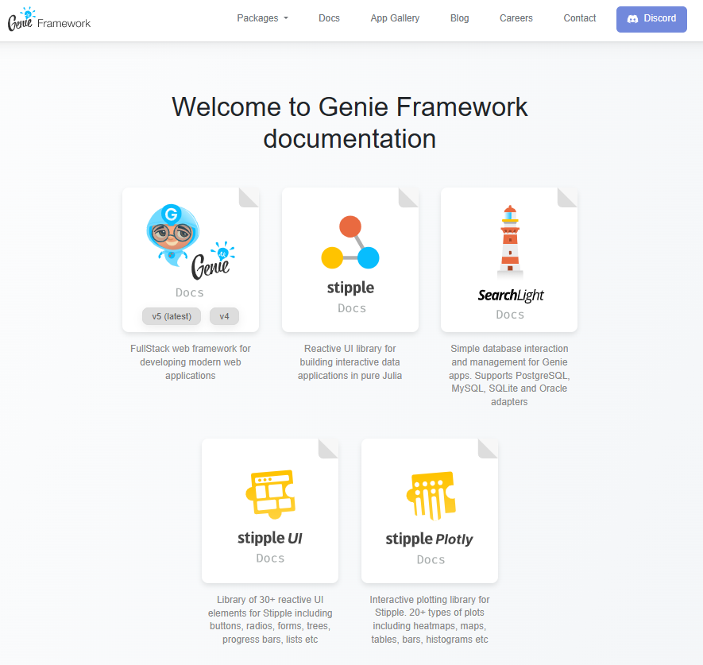
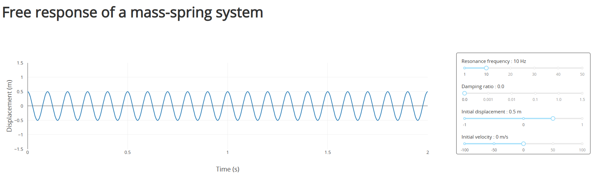
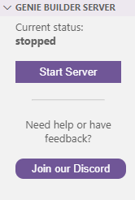
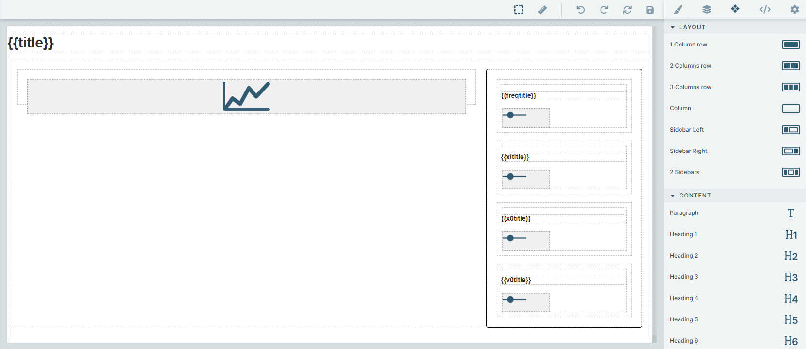
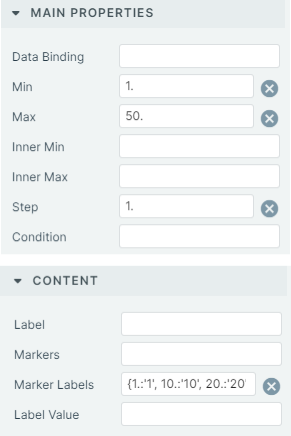
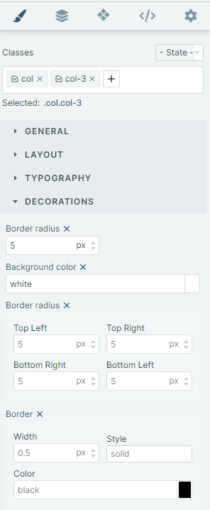
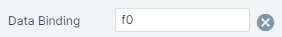
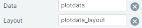

---
This post has been first publish on Julia Forem. To read the original post, please visit [Julia Forem](https://forem.julialang.org/maucejo/make-beautiful-web-apps-with-genie-builder-40f5).

---

In a previous [post](https://forem.julialang.org/maucejo/make-beautiful-web-apps-with-dashjl-4kkf), I tried to explain how to use Dash.jl to develop a web app to illustrate the vibration behavior of undamped/damped mass-spring oscillators.

Today, my goal is to develop the same application, but with Genie Builder, a VSCode plugin that aims to simplify the creation of the user interface by dragging and dropping interface elements. I have to admit that this is a very exciting proposition, especially for people not well versed in HTML and CSS.

## Table Of Contents

1. [First steps](#FirstSteps)
2. [Goal of the app](#app)
3. [Let's implement the app!](#code)
4. [Final thoughts](#conclusion)

## 1. First steps <a name="FirstSteps"></a>

As for any framework, one of the best practice is to read the documentation. The natural entry point is the documentation section of the web site dedicated to the [Genie Framework](https://genieframework.com/docs/index.html).

<figure>

<figcaption>Genie Framework Documentation section</figcaption>
</figure>

As you can see on the previous picture, the Genie framework is built around five modules (Genie, Stipple, SearchLight, StippleUI and StipplePlotly). At the time of writing this post (January 2023), you have to keep in mind that the documentation is still under development, meaning that all the information needed for building the present app are lacking. However, this is compensated by the active and and friendly Genie community and the existence of a discord channel (special thanks to @abhimanyuaryan for guiding my first steps with the Genie Builder). Finally, the best way I found to familiarize with the Genie Builder are the tutorial written by @pgimenez that you can find [here](https://genieframework.com/blog/how-to-quickly-turn-your-julia-code-into-a-web-app-with-genie-builder/) and [there](https://genieframework.com/blog/genie-builder-v02-speed-up-julia-app-development/).

## 2. Goal of the app <a name="app"></a>

The app we want to develop is a 1:1 translation of the app I have previously implemented using Dash.jl and presented in the figure below.

<figure>

<figcaption>Target application developed using Dash.jl</figcaption>
</figure>

As shown in the previous picture is composed of:
* A header
* A plotting zone
* A zone containing four sliders whose titles display the current value of each slider

In the rest of this tutorial, I will try to show how easy it is to create an application using Genie Builder.

## 3. Let's implement the app!

Before entering in the core of this tutorial, it is important to briefly explain how to create an app with Genie Builder. I suppose here that you have already install the plugin in VSCode. That being said, we can divide the process into 4 steps:

### 3.1. Start the server

You have to click on `Start Server` in the `Genie Builder Server` panel. This step is mandatory to open the no-code interface for building the UI.

<figure>

<figcaption>Click on Start Server</figcaption>
</figure>

> On my machine (Dell Latitude 7410 - Intel Core i7-10610U @1.8 GHz (8 CPUs) - 32 Gb RAM), the server starts in 1min 45s on average.
> *Disclaimer: The elapsed time is the average of five measurements carried out by the chronometer of my cell phone!*

### 3.2. Create a new app

To this end, you just have to click on `+` in the `Genie Builder Apps` panel

<figure>

<figcaption>Click on + to create a new app</figcaption>
</figure>

By default, this creates a basic app structure. One has to note that the app is actually a Julia project, which is saved in the  `/.julia/geniebuilder/apps` folder. I have to admit that I would prefer to save the app in the folder of my choice. I hope it will be possible in a near future (but it is not very important. It just more convenient IMHO). At the very beginning, the apps folder contains four files:
* `app.jl` containing the analysis code and the app's logic.
* `app.jl.html` containing the HTML components defining the UI
* `Project.toml` and `Manifest.toml`

> On my machine, starting the app takes 1min on average. This timing include the loading of the app (detection of app.jl.html, bindings, ...) and the no-code interface (and many other things).

The code of the generic app is as follows:
* for `app.jl`
```julia
module App

using GenieFramework
@genietools

@app begin
  @out message = "Hello World!"

  @onchange isready begin
    @show "App is loaded"
  end
end

@page("/", "app.jl.html")

end
```
* for `app.jl.html`

```julia
<h1>{{message}}</h1>
<p>This is the default view for the application.</p>
<p>You can change this view by editing the file <code>app.jl.html</code>.</p>
```

Some comments can be made here:
* A Genie app is defined as a Julia module and not a script. So, it can't be launch directly using `julia MyApp.jl`. See @pgimenez [tutorial](https://genieframework.com/blog/how-to-quickly-turn-your-julia-code-into-a-web-app-with-genie-builder/) for instance. 
* The macro `@genietools` can be seen as a shortcut for `using Genie, Stipple, StippleUI, StipplePlotly`. This macro performs other operations. For more information, see [GenieFramework.jl Github repo](https://github.com/GenieFramework/GenieFramework.jl).
* Any text of the app can modified programmatically. To do this, a variable `mytext` must be defined in the `app.jl` using `@out mytext = "My custom text"`. Then, to make this text appear when the app is launched in a web browser, a reference to the variable `mytext` must be done in `app.jl.html` using `{{mytext}}`.
* The macro `@page` generates the HTML code corresponding to a single page application. See [Stipple.jl Documentation](https://genieframework.com/docs/stipple/v0.25/API/layout.html#Stipple.Layout.page) for details.

To start with a fresh app, you can erase the content of `app.jl.html`, while keeping the structure of the `app.jl` file, that is:

```julia
module App

using GenieFramework
@genietools

# Put/include the analysis code here

@app begin
  # Define the inputs and the outputs here

  @onchange isready begin
    # Define the interactivity here
  end
end

@page("/", "app.jl.html")

end
```

### 3.3. Create the analysis code

The analysis code is exactly the same as that explained in my post on [Dash.jl](https://forem.julialang.org/maucejo/make-beautiful-web-apps-with-dashjl-4kkf). It basically contains two functions:
* `response` that computes the free response of the mass of a mass-spring system for a given frequency 
$f_0$
, damping ratio 
 $\xi$
 and in displacement and velocity initial conditions, 
 $x_0$
 and 
 $v_0$
.
* `damping` that defines the mapping between a discrete set of damping factors and the values of the slider will create later. This function allows to keep constant the gap between each value of the slider.

For the sake of completeness, the analysis code is recalled below:
```julia
const t = 0.:1e-3:2.

function response(f₀ = 10., ξ = 0.01, x₀ = 1., v₀ = 1.)
    ω₀ = 2π*f₀
    if 0. ≤ ξ < 1.
       Ω₀ = ω₀*√(1. - ξ^2)
      x = (x₀*cos.(Ω₀*t) + (v₀ + ξ*ω₀*x₀)*sin.(Ω₀*t)/Ω₀).*exp.(-ξ*ω₀*t)
    elseif ξ == 1.
      x = @. (x₀ + ω₀*x₀*t + v₀*t)*exp(-ω₀*t)
    else
      β = ω₀*√(ξ^2 - 1.)
      x = @. (x₀*cosh(β*t) + (v₀ + ξ*ω₀*x₀*sinh(β*t))/β)*exp(-ξ*ω₀*t)
    end
end

function damping(value)
    if value == 1
        return 0.
    elseif value == 2
        return 0.001
    elseif value == 3
        return 0.01
    elseif value == 4
        return 0.1
    elseif value == 5
        return 1.
    else
        return 1.5
    end
end
```

### 3.4. Create the UI using the no-code editor

The no-code editor allows defining the UI by dragging and dropping interface elements. For our app, the UI looks like the following picture.

<figure>

<figcaption>View of the no-code editor</figcaption>
</figure>

To create the interface, we have created:
* A `h1` environment containing the title of the app using `Content -> H1`. The latter will be programmatically defined through the variable `title`.
* Two columns using the `Layout -> Sidebar right` element of the no-code editor. In the left column, a line plot has been inserted using the `Charts -> Line` element of the editor. The right column requires more work, since it contains 4 sliders, each of them having a title. Each slider is created using the following procedure:

     a. Use `Content -> Title + Content`. This creates a `h6` environment to define the title of the slider. This title must be defined programmatically if one wants to display the current value of the slider in the corresponding title. Here, the titles are created from the variables `freqtitle`, `xititle`, `x0title` and `v0title`.

    b. Use `Forms -> Slider` to create a slider. Its complete definition can be made by clicking on the slider and filling its properties. For instance, one has for the slider related to the value of the natural frequency of the mass-spring system:

<figure>

<figcaption>Definition of the slider properties</figcaption>
</figure>

Finally, the decoration of the right column can be set by selecting the column, clicking on `Open Style Manager` (i.e. click on the pencil in the editor) and filling the `Decorations` section (see Figure below).

<figure>

<figcaption>Column decoration</figcaption>
</figure>

Thanks to the no-code editor, one obtains the following `app.jl.html` file:
```html
<h1 id="iqml">{{title}}</h1>
<div class="row">
    <div class="col">
        <plotly :data="[{
      x: [2, 3, 4, 5],
      y: [16, 5, 11, 9],
      mode: 'lines',
      type: 'scatter'
    }]"></plotly>
    </div>
    <div class="col col-3">
        <div class="row">
            <div class="col col-12">
                <h6>{{freqtitle}}</h6>
                <q-slider :min="1." :max="50." :step="1." :marker-labels="{1.:'1', 10.:'10', 20.:'20', 30.:'30', 40.:'40', 50:'50'}"></q-slider>
            </div>
        </div>
        <div class="row">
            <div class="col col-12">
                <h6>{{xititle}}</h6>
                <q-slider :min="1" :max="6" :step="1" :marker-labels="{1:'0', 2:'0.001', 3:'0.01', 4:'0.1', 5:'1', 6:'1.5'}"></q-slider>
            </div>
        </div>
        <div class="row">
            <div class="col col-12">
                <h6>{{x0title}}</h6>
                <q-slider :min="-1." :max="1." :step="0.1" :marker-labels="{'-1':'-1', '-0.5':'-0.5', '0':'0', '0.5':'0.5', '1':'1'}"></q-slider>
            </div>
        </div>
        <div class="row">
            <div class="col col-12">
                <h6>{{v0title}}</h6>
                <q-slider :min="-100." :max="100." :step="1." :marker-labels="{'-100':'-100', '-50':'-50', '0':'0', '50':'50', '100':'100'}"></q-slider>
            </div>
        </div>
    </div>
</div>
```

As you can see in the code above:
* The plotting interface is `Plotly` thanks to `StipplePlotly.jl`. By default, the editor creates a dummy line plot.
* Under the hood, Genie Builder uses Quasar components under the hood (`q-slider`). This is interesting, since you can have a look on the [Quasar website](https://quasar.dev/) to learn how to use a particular components of the no-code editor. This avoid the Genie team duplicating the documentation. Nice idea!

To finish the app, it remains to connect the UI elements to the analysis code.

### 3.5 Make the app interactive!

To make the app interactive, one has to define its inputs and its outputs. It is easily done thanks to the `@in` and `@out` macros. To summarize a little bit, the inputs are the values of the sliders. Here, they are named `f0, xi, x0, v0`, while the outputs are the title of the app `title`, the titles of the sliders `freqtitle, xititle, x0title, v0title` and the plot `plotdata` and its layout `plotdata_layout`. The code corresponding to the initialization of this variable is:

```julia
  @in f0 = 10.
  @in xi = 3
  @in x0 = 0.5
  @in v0 = 0.

  @out title = "Free response of a mass-spring system"
  @out freqtitle = ""
  @out xititle = ""
  @out x0title = ""
  @out v0title = ""

  @out plotdata_layout = PlotLayout(
    xaxis = [PlotLayoutAxis(title_text = "Time (s)",title_font = Font(20), tickfont = Font(14))],
    yaxis = [PlotLayoutAxis(xy = "y", title_text = "Displacement (m)", ticks = "outside", ticklen = 10, tickcolor = "white", title_font = Font(20), tickfont = Font(14))]
  )
  @out plotdata = PlotData()
```
As a side note, the documentation of `PlotLayoutAxis` can found [here](https://genieframework.com/docs/stippleplotly/v0.13/API/layouts.html). At the time of writing this tutorial (January 2023), the function `PlotLayout` was not documented. However, its basic usage can be found by exploring the [example apps](https://genieframework.com/app-gallery/) provided by the Genie Team.

At the stage, we have to implement the callback that allows to update the plot when the value of one the sliders changes. It is basically done thanks to the macro `@onchangeany`, that monitor any change in the input variables `f0, xi, x0, v0`. In the present case, the callback is implemented as follows:

```julia
@onchange isready, f0, xi, x0, v0 begin
    freqtitle = "Resonance frequency: $(Int(f0)) Hz"
    xititle = "Damping ratio: $(damping(xi))"
    x0title = "Initial displacement: $(round(x0, digits=1)) m"
    v0title = "Initial velocity: $(Int(v0)) m/s"

    rep = response(f0, damping(xi), x0, v0)
    plotdata = PlotData(
      x = t,
      y = rep,
      mode = "lines"
    )
```
It should be noted here that the function `PlotData` is not currently documented. However, it seems to follow a syntax similar to `PlotlyJS.jl`.

To complete the interactivity part of this tutorial, we have to assign the value of each slider to the corresponding variable. To do this, we have to return to the no-code interface, select each slider element and fill the `Data Binding` item. For instance, to assign the value of the slider to `f0`, we have:

<figure>

<figcaption>Data Binding for f0</figcaption>
</figure>

For connecting the plot area to `plotdata` and `plotdata_layout`, we have to click of the plot element and fill the `Data` and `Layout` items as follows:

<figure>

<figcaption>Connection of the plot are to plotdata and plotdata_layout</figcaption>
</figure>

These operations are translated into code in the following way:

```html
# For the plot area
<div class="col">
        <plotly :data="plotdata" :layout="plotdata_layout"></plotly>
</div>

# For sliders
<q-slider v-model="f0" :min="1." :max="50." :step="1." :marker-labels="{1.:'1', 10.:'10', 20.:'20', 30.:'30', 40.:'40', 50:'50'}"></q-slider>
```

### 3.6. Let's finish the app

To finish our app, it remains to define the title appearing in the tab of the web browser. How to do this with Genie builder is no documented. However, the answer can be found on the discord channel of the Genie Framework. This done by defining our title as a constant string and by adding it as a parameter of the macro `@page` that generates the HTML code of the app. In more explicit terms, this code in the following way:

```julia
const apptitle = "Free response of a mass-spring system"
@page("/", "app.jl.html", Stipple.ReactiveTools.DEFAULT_LAYOUT(title = apptitle))
```

As indicated by @pgimenez in his [post](https://forem.julialang.org/pgimenez/how-to-quickly-turn-your-julia-code-into-a-web-app-with-genie-builder-35i3), the standard way to run the app outside of Genie Builder consists in including `Server.isrunning() || Server.up(8050)` (where 8050 is the port number) at the end of `app.jl`. Then, to launch the app, one just has to open the REPL with `julia --project` in the app's folder and type `include("app.jl")`.

## 4. Final thoughts <a name="conclusion"></a>

Genie Builder is a fantastic tool to create an application quickly and easily. From my limited experience with Dash and Genie, both frameworks seem to be on par in terms of functionality. So the choice of framework is mainly a matter of taste. The no-code interface is a really cool feature, especially for people who are not well versed in html or ill at ease when building a UI programmatically. I think the no-code interface is a must-have feature that is not currently available for `Dash.jl`.

That being said, an another point of comparison is the starting time of the applications. For the present, the starting times obtains from a fresh julia session are:
* 2min 20s for the Genie app
* 50s for the Dash app
Except this noticeable difference, the user experience is similar.

In conclusion, there is no good choice. `Genie` and `Dash` are two really good frameworks. They have both their own components library (included in `StippleUI` for `Genie`) or can use external library such as Quasar for `Genie` and Bootstrap for `Dash.jl` through `DashBootstrapComponents.jl`. For plotting, both frameworks use `Plotly` as a backend. I strongly encourage you to use both!
