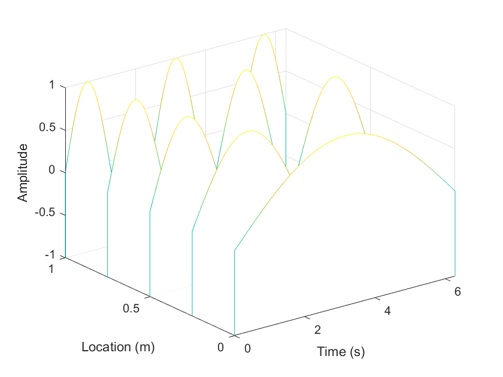
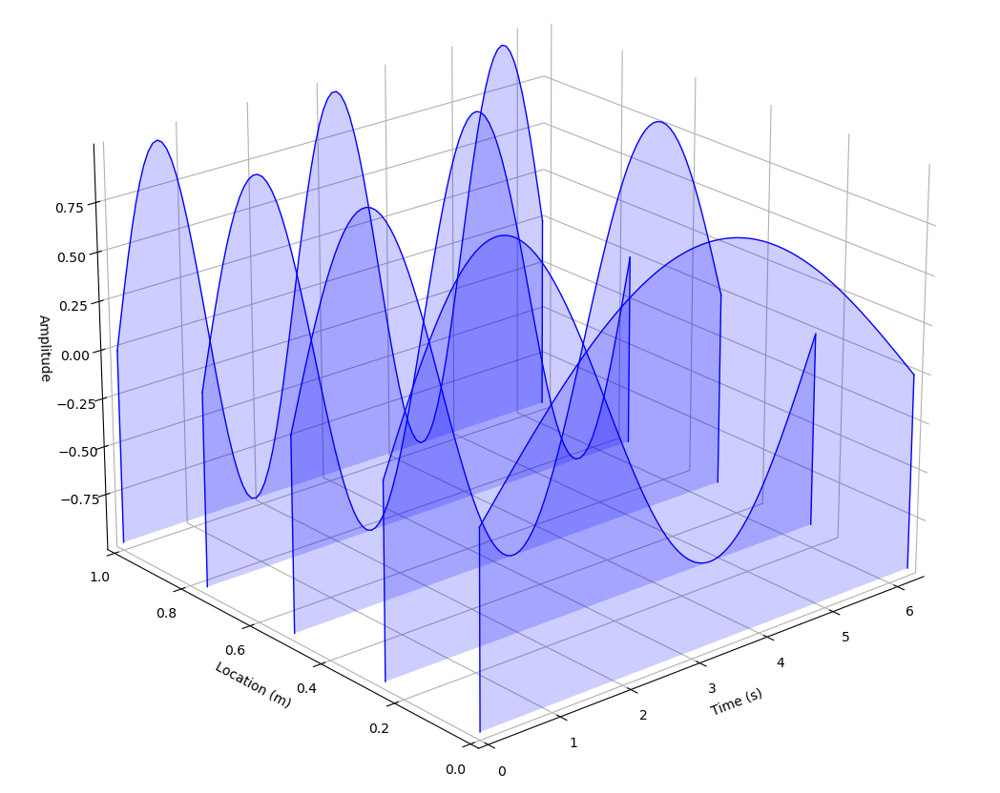
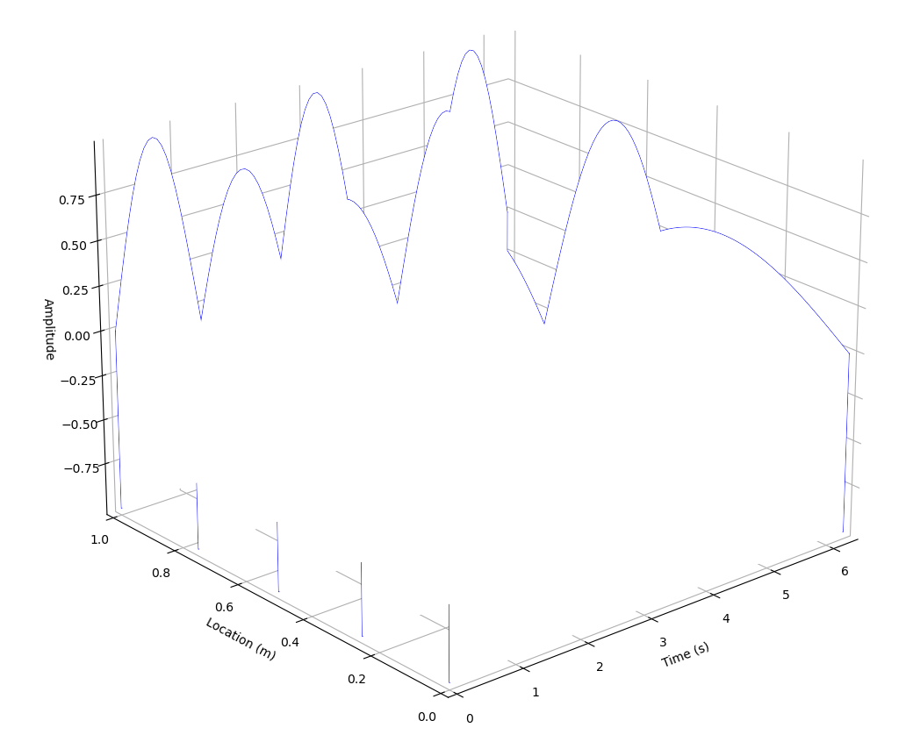
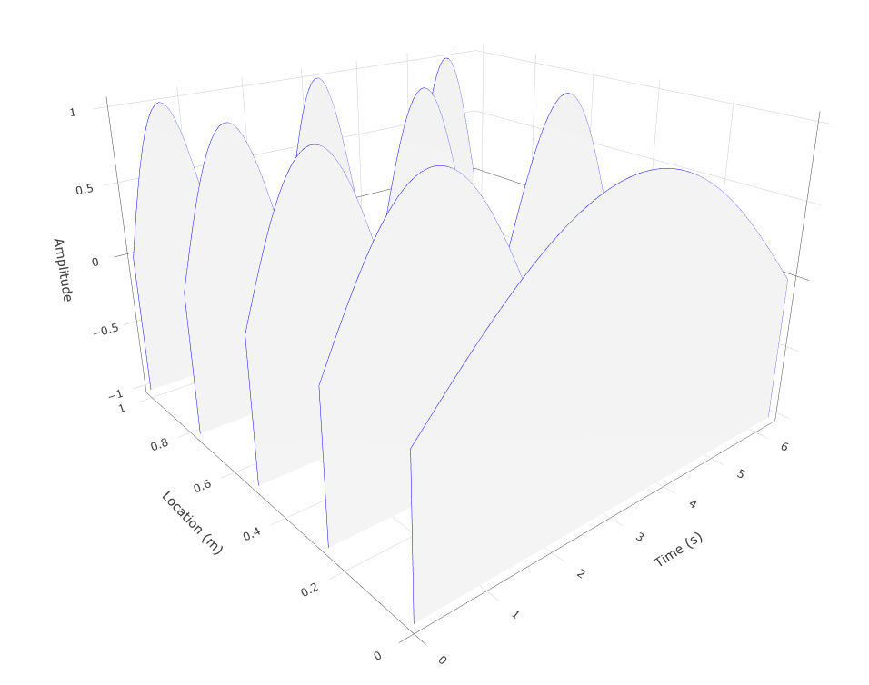
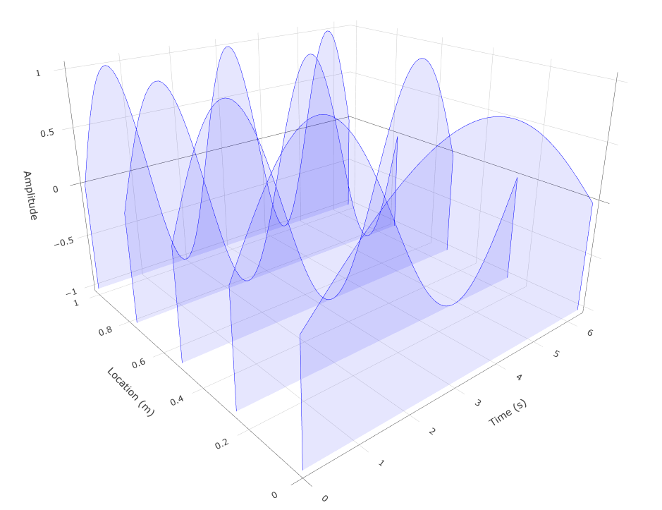
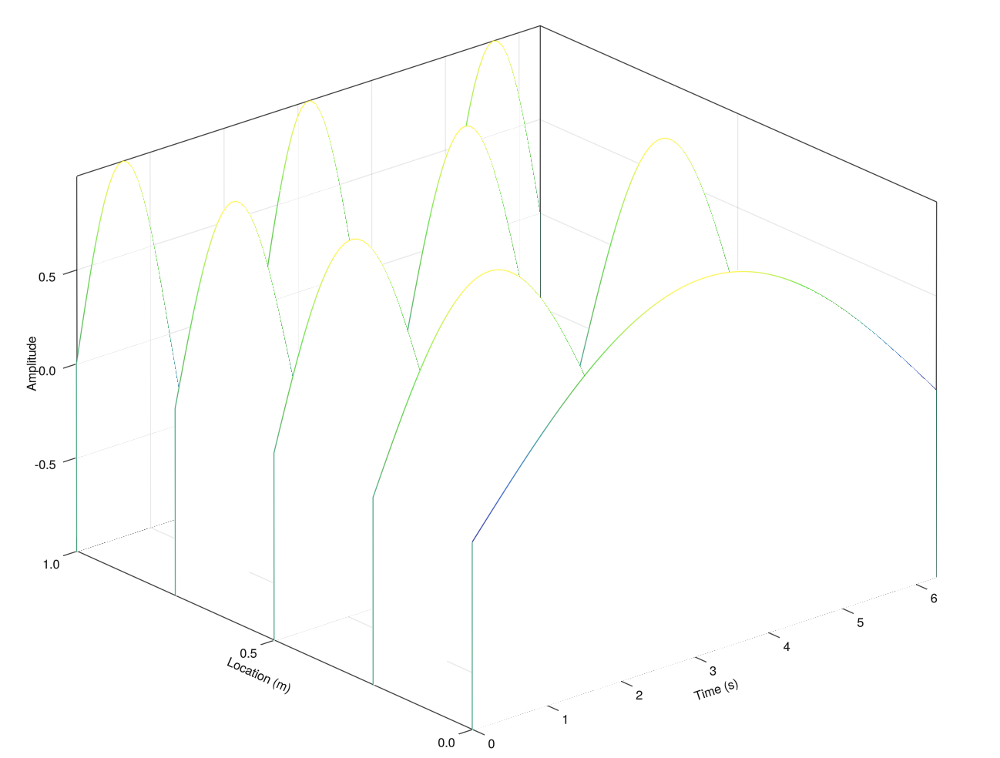
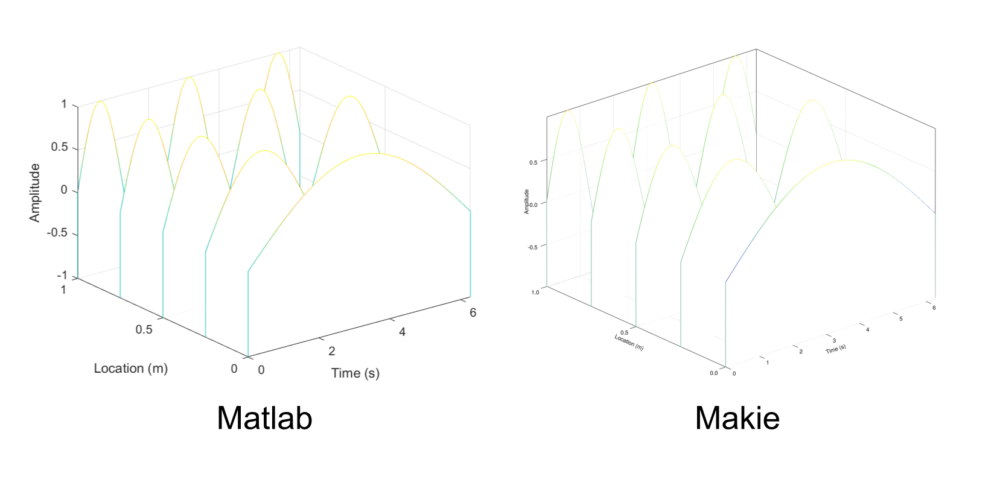
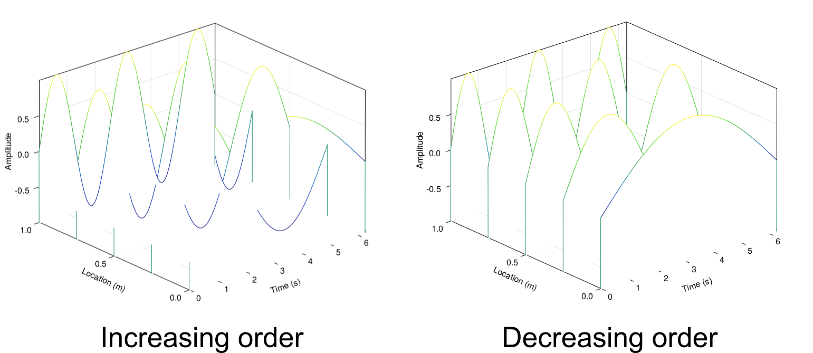

---
This post has been first publish on Julia Forem. To read the original post, please visit [Julia Forem](https://forem.julialang.org/maucejo/waterfall-plot-a-la-matlab-using-pyplot-plotlyjs-and-makie-4do4).

---

When I switched from Matlab to Julia, one of the Matlab features I really missed was the waterfall plot and I am not the only one (see [here](https://discourse.julialang.org/t/how-can-i-make-this-plot/31278) and [there](https://discourse.julialang.org/t/how-to-produce-a-waterfall-plot-in-julia/93441)). Actually, such a plot is the ideal way to display space-time or space-frequency series, for example.

In this tutorial, I will try to show you how to reproduce the following Matlab figure.

<figure>

<figcaption>Waterfall plot to reproduce - Matlab</figcaption>
</figure>

<details>
    <summary>Matlab code</summary>

    x = linspace(0, 2*pi, 100);
    y = linspace(0, 1, 5);
    z = zeros(5, 100);

    for i = 1:5
        z(i, :) = sin(i*x/2);
    end

    waterfall(x, y, z)
    xlabel('Time (s)')
    ylabel('Location (m)')
    zlabel('Amplitude')
</details>

My goal in this tutorial is to try to reproduce as closely as possible the previous figure using `Makie.jl`, `PyPlot.jl` and `PlotlyJS.jl`.

Let's go!

## 0. Data generation

```julia
x = range(0., 2π, 100)
y = range(0., 1., 5)

nx = length(x)
ny = length(y)
z = zeros(ny, nx)

for i in eachindex(y)
    z[i, :] = sin.(i*x/2.)
end
```

## 1. PyPlot.jl

[PyPlot.jl](https://github.com/JuliaPy/PyPlot.jl) provides a Julia interface to the Matplotlib plotting library from Python thanks to `PyCall.jl`. The syntax is similar to `matplotlib.pyplot` making it easier to convert python code into julia code. You can find a lot of PyPlot examples [here](https://gist.github.com/gizmaa/7214002). 

For implementing the waterfall plot with `PyPlot.jl`, I took my inspiration from [the blog post of Siladittya Manna](https://medium.com/the-owl/how-to-plot-multiple-2d-series-in-3d-in-matplotlib-16f2d0aacd12). This blog explains how to obtain a waterfall plot using `Matplotlib`. I have adapted the pieces of codes given in this blog to fit my needs.

In the end, the function `waterfall_pyplot` is implemented as follows:

```julia
# using PyPlot

function waterfall_pyplot(x, y, z; zmin = minimum(z), lw = 1., colorline = :blue, colorband = :blue, alpha = 0.1, xlab = "x", ylab = "y", zlab = "z")
    # Initialisation
    nx = length(x)

    fig = figure(figsize = (8, 6), layout = "constrained")
    using3D()
    ax = fig[:add_subplot](111, projection = "3d")
    for (j, yv) in enumerate(y)
        zj = z[j, :]
        yj = yv*ones(nx)

        # Line
        ax.plot(x, yj, zs = zj, zdir = "z", lw = lw, color = colorline)

        # Surface under the line
        col = ax.fill_between(x, zmin, zj, fc = colorband, alpha = alpha)
        ax.add_collection3d(col, zs = yj, zdir = "y")

        # Edges
        ax.plot(x[1]*ones(2), yv*ones(2), zs = [zmin, zj[1]], zdir = "z", lw = lw, color = colorline)
        ax.plot(x[end]*ones(2), yv*ones(2), zs = [zmin, zj[end]], zdir = "z", lw = lw, color = colorline)
    end

    # Set camera view
    ax.view_init(elev = 22.5, azim = 229.5)

    # Set axes titles
    ax.set_xlabel(xlab)
    ax.set_ylabel(ylab)
    ax.set_zlabel(zlab)

    # Set the pane color white
    ax.w_xaxis.set_pane_color((1.0, 1.0, 1.0, 0.0))
    ax.w_yaxis.set_pane_color((1.0, 1.0, 1.0, 0.0))
    ax.w_zaxis.set_pane_color((1.0, 1.0, 1.0, 0.0))

    fig
end
```

To compute the figure and display it, you just have to type:
```julia
waterfall_py(x, y, z, xlab = "Time (s)", ylab = "Location (m)", zlab = "Amplitude")

plt.show()
```

TA-DA!

<figure>

<figcaption>Waterfall plot - PyPlot.jl</figcaption>
</figure>

Some comments have to be made here:
1. Drawing multicolor 3d lines is pretty tricky with matplotlib since we have to define a `LineCollection` (see [Matplotlib documentation](https://matplotlib.org/stable/gallery/lines_bars_and_markers/multicolored_line.html) or [Stack Overflow](https://stackoverflow.com/questions/26726100/plotting-multiple-segments-with-colors-based-on-some-variable-with-matplotlib)).
2. For obtaining a good looking plot, it is recommended to add some transparency to the surfaces. Indeed, when there is no transparency, `waterfall_py(x, y, z, colorband = :white, alpha = 1.)` gives for instance (Pretty ugly, no?)

<figure>

<figcaption>Ugly waterfall plot - PyPlot.jl</figcaption>
</figure>

## 2. PlotlyJS.jl

[PlotlyJS.jl](https://github.com/JuliaPlots/PlotlyJS.jl) provides a Julia interface to the plotly.js plotting library. A good starting point is the [documentation](http://juliaplots.org/PlotlyJS.jl/stable/) that gives many examples.

However, to obtain a waterfall plot a la matlab, I had to ask help to the julia community. A special thank to @empet on the julia discourse. After a long battle, the waterfall plot can be implemented as follows:

```julia
# using PlotlyJS

function waterfall_plotly(x, y, z; zmin = minimum(z), lw = 1., colorline = :blue, colorband = :white, alpha = 1., xlab = "x", ylab = "y", zlab = "z")
    # Initialisation
    nx = length(x)
    nv = Int(round(nx./2.))

    vl = range(0., 1., nv)
    v = repeat(vl, 1, nx)
    X = repeat(transpose(x), nv, 1)
    cols = [[0, colorband],  [1, colorband]]

    traces = GenericTrace[]
    for (j, yv) in enumerate(y)
        zj = z[j, :]
        Y = yv*ones(nx)

        # Line
        trace = scatter3d(x = x,
                       y = Y,
                       z = zj,
                       mode = "lines",
                       line = attr(color = colorline, width = lw),
                       showlegend = false)

        # Surface
        Z = zmin .+ (repeat(transpose(zj), nv, 1) .- zmin).*v
        surf = surface(x = X,
                       y = Y,
                       z = Z,
                       colorscale = cols, opacity = alpha, showscale = false)

        # Edges
        edge_start = scatter3d(x = x[1]*ones(2),
                                   y = yv*ones(2),
                                   z = [zmin, zj[1]],
                                   mode = "lines",
                                   line = attr(color = colorline, width = lw), showlegend = false)
        edge_end = scatter3d(x = x[end]*ones(2),
                                 y = yv*ones(2),
                                 z = [zmin, zj[end]],
                                 mode = "lines",
                                 line = attr(color = colorline, width = lw), showlegend = false)

        append!(traces, [edge_start, trace, edge_end, surf])
    end

    # Define camera angles
    xcam, ycam, zcam = camera_angle()

    # Define the layout
    layout = Layout(scene = attr(
        xaxis = attr(autorange = "reversed", automargin = true),
        yaxis = attr(autorange = "reversed", automargin = true),
        camera = attr(eye = attr(x = xcam, y = ycam, z = zcam)),
        aspectratio = attr(x = 1., y = 1, z = 2/3),
        xaxis_title = xlab,
        yaxis_title = ylab,
        zaxis_title = zlab))

    fig = plot(traces, layout)
    relayout!(fig, template = :plotly_white)
    fig
end

function camera_angle(azimuth = 50, elevation = 22.5; R = 2.)
    ϕ = deg2rad(azimuth)
    θ = deg2rad(elevation)
    x = R*cos(θ)*cos(ϕ)
    y = R*cos(θ)*sin(ϕ)
    z = R*sin(θ)

    return x, y, z
end
```

To compute the figure and display it, you just have to type:
```julia
fig = waterfall_plotly(x, y, z, xlab = "Time (s)", ylab = "Location (m)", zlab = "Amplitude")

wait(display(fig))
```

Et voilà!

<figure>

<figcaption>Waterfall plot - Plotly</figcaption>
</figure>

The salient points for obtaining this plot are:
1. All the traces have to be collected in a vector, hence the use of `traces = GenericTrace[]`.
2. For the surface, see the explanation given by @empet [here](https://discourse.julialang.org/t/fill-area-under-3d-curve-plotlyjs-jl/94556). Basically, we have to define a 3d grid of points to fill the surface going from `zmin` to `z(x, y)` for a given `(x, y)` set of coordinates.
3. The location of the camera is defined by its Cartesian coordinates `(x, y, z)` which seems to me unnatural, given that elevation and azimuth are generally preferred in most of plotting packages. That is why, I have defined the function `camera_angles` taking for arguments the azimuth, the elevation and the radius of the sphere on which the camera is set.
4. There is currently no solution to have multicolored lines. At the moment only the `scatter` mode allows this.

Of course, we can play with the color and the transparency of the surface to obtain a plot similar to that generated with `PyPlot.jl`.

<figure>

<figcaption>Waterfall plot with blue and transparent surfaces - Plotly</figcaption>
</figure>

## 3. Makie

Makie is a data visualization ecosystem for the Julia programming language, with high performance and extensibility. It a pure Julia plotting library (89.4 % of the code base is written in Julia).

To achieve my goal, I had a look on the [Makie documentation](https://docs.makie.org/stable/), the [Beautiful Makie website](https://beautiful.makie.org/dev/) and in the sixth chapter of [Julia Data Science](https://juliadatascience.io/DataVisualizationMakie) written by Jose Storopoli, Rik Huijzer and Lazaro Alonso. To be fair, I found the master piece for implementing the waterfall plot in section 6.9.5 of the latter book.

By putting everything together, I finally obtained the following function:

```julia
# using GLMakie or CairoMakie

function waterfall_makie(x, y, z; zmin = minimum(z), lw = 1., colmap = :linear_bgy_10_95_c74_n256, colorband = (:white, 1.), xlab = "x", ylab = "y", zlab = "z")
    # Initialisation
    fig = Figure()
    ax = Axis3(fig[1,1], xlabel = xlab, ylabel = ylab, zlabel = zlab)
    for (j, yv) in enumerate(y)
        zj = z[j, :]
        lower = Point3f.(x, yv, zmin)
        upper = Point3f.(x, yv, zj)
        edge_start = [Point3f(x[1], yv, zmin), Point3f(x[1], yv, zj[1])]
        edge_end = [Point3f(x[end], yv, zmin), Point3f(x[end], yv, zj[end])]

        # Surface
        band!(ax, lower, upper, color = colorband)

        # Line
        lines!(ax, upper, color = zj, colormap = colmap, linewidth = lw)

        # Edges
        lines!(ax, edge_start, color = zj[1]*ones(2), colormap = colmap, linewidth = lw)
        lines!(ax, edge_end, color = zj[end]*ones(2), colormap = colmap, linewidth = lw)
    end

    # Set axes limits
    xlims!(ax, minimum(x), maximum(x))
    ylims!(ax, minimum(y), maximum(y))
    zlims!(ax, zmin, maximum(z))

    fig
end
```

To compute the figure and display it, you just have to type:
```julia
fig = waterfall_plotly(x, y, z, xlab = "Time (s)", ylab = "Location (m)", zlab = "Amplitude")

wait(display(fig))
```

Bingo!

<figure>

<figcaption>Waterfall plot - Makie.jl</figcaption>
</figure>

For the sake of comparison, Matlab vs Makie waterfall plots are presented side by side below.

<figure>

<figcaption>Matlab vs Makie</figcaption>
</figure>

Some comments:
1. It is possible to easily affect a colormap to a line and adjust the color w.r.t. the the corresponding z-value.
2. The surface below the line is easily drawn using the function `band!`.
3. With `CairoMakie.jl`, each group (lines + band) has to be drawn in a decreasing order to obtain the desired figure. This done by replacing `enumerate(y)` by `enumerate(reverse(y))` and replacing `j` by `length(y) - j + 1`. If we draw each group in an increasing order as for `PyPlot.jl` and `PlotlyJS.jl`, the resulting figure is quite ugly. This problem doesn't appear with `GLMakie.jl`.

<figure>

<figcaption>Influence of the plotting order with CairoMakie.jl</figcaption>
</figure>

## 4. Final Thoughts

I hope this tutorial will help you to consider Julia as a viable alternative. What I tried to prove in this tutorial is that `PyPlot.jl`, `PlotlyJS.jl` or `Makie.jl` all do a good job. It all depends on your background and needs. For building interactive web applications with `Dash.jl` or `Genie.jl` you need to use `PlotlyJS.jl`. It is also a very good package for exploratory analysis. For Python users, `PyPlot.jl` (or `PythonPlot.jl`) is certainly the package to use. Of course, `Makie.jl` can cover all your needs if you give it a try.

The winner here is clearly `Makie.jl`, since it allows you to get the look and feel of Matlab's waterfall plot (which was the goal of this tutorial). But more than that, I find `Makie.jl` easier to use and very mature. This may be due to the fact that it is a plotting package designed exclusively for Julia.